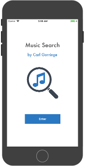
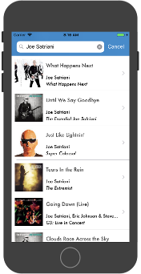

## MusicSearch-iOS

By [Carl Gorringe](http://carl.gorringe.org)

An example native iOS App written in Objective-C that searches the iTunes API for songs by a given artist and displays them in a table view.  After selecting the song, another API is used to retrieve song lyrics.

## License

Copyright (c) 2018 Carl Gorringe. All rights reserved.

Licensed under the the terms of the [GNU General Public License version 3 (GPLv3)](http://www.gnu.org/licenses/gpl-3.0.html).
